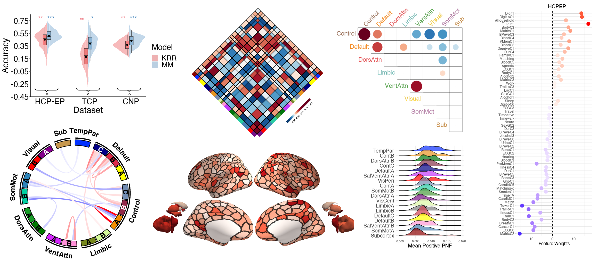

Reliable and generalizable brain-based predictions of cognitive
functioning across common psychiatric illness
================

## Reference

Chopra, S., Dhamala, E., Lawhead, C., Ricard, J., Orchard, E., An, L.,
Chen, P., Wulan, N., Kumar, P., Rubenstein. A., Moses, J., Chen, L.,
Levi, P., Aquino, K., Fornito, A., Harpaz-Rotem, I., Germine, L., Baker,
J., Yeo, BT., Holmes, A. (2022) [Reliable and generalizable brain-based
predictions of cognitive functioning across common psychiatric
illness](https://www.medrxiv.org/). medRxiv.

------------------------------------------------------------------------

## Background

A primary aim of precision psychiatry is the establishment of predictive
models linking individual differences in brain functioning with clinical
symptoms. In particular, cognitive impairments are transdiagnostic,
treatment resistant, and contribute to poor clinical outcomes. Recent
work suggests thousands of participants may be necessary for the
accurate and reliable prediction of cognition, calling into question the
utility of most patient collection efforts. Here, using a
transfer-learning framework, we train a model on functional imaging data
from the UK Biobank (n=36,848) to predict cognitive functioning in three
transdiagnostic patient samples (n=101-224). The model generalizes
across datasets, and brain features driving predictions are consistent
between populations, with decreased functional connectivity within
transmodal cortex and increased connectivity between unimodal and
transmodal regions reflecting a transdiagnostic predictor of cognition.
This work establishes that predictive models derived in large
population-level datasets can be exploited to boost the prediction of
cognitive function across clinical collection efforts.

## Code and Data release

### Code

The `scripts` folder contains the two folders: `analysis` and
`visualisation`:

- The `analysis` folder contains three sub-folders and a conda
  environment file used for all analyses
  (`predictingCognition_env.yml`):
  - `accuracy` - contains python scripts that execute both meta-matching
    ([`compute_MM_cognitionPC.py`](https://github.com/sidchop/PredictingCognition/blob/master/scripts/analysis/accuracy/compute_MM_cognitionPC.py)
    and kernel ridge regression models
    ([`compute_KRR_cognitionPC.py`](https://github.com/sidchop/PredictingCognition/blob/master/scripts/analysis/accuracy/compute_KRR_cognitionPC.py).
    The `master_run.sh` script executes all python scripts with flags to
    indicating study sample and covariate regression. The `nulls_runHPC`
    folder contains scripts used to generate null prediction models and
    were executed on a High performance computing cluster.
  - `genralizibility` - contains two python scripts used to test the
    genralizibility of the meta-matching (`mm_cogs_generalize.py`) and
    kernel ridge regression (\``krr_cogs_generalize.py`\`) models
    (i.e. train on one full dataset and test on another independent
    dataset).
  - `feature weights` - contains a python script to generate spatially
    auto-correlated nulls (spin test), and conduct sig testing on the
    feature weights generated.
- The `visualisation` folder contains a Rmarkdown file (`figures.Rmd`)
  used to generate each main test and supplementary figure included in
  the paper. Each code chunk corresponds to a figure or panel. The brain
  renderings in Fig4 require a python env with both `pyvista` and
  `pysurfer` working smoothly (good luck!) Some examples below.

------------------------------------------------------------------------

### Data

- The primary data using are brain (419 x 419) FC matrices and cognitive
  functioning principal component scores for three data sets:

  - Human Connectome Project - Early Psychosis (HCP-EP; n=145)

  - Transdiagnostic Connectomes Project (TCP; n=101)

  - Consortium for Neuropsychiatric Phenomics (CNP; n=224)

- FC matrices and cognitive functioning principal component scores for
  TCP and CNP can be shared openly. These files are \>100mb and will
  soon be uploaded here. The HCP-EP data requires data access permission
  and if you have this, we are happy to share the processed data used
  here.

- All model outputs used in the paper and to generate all figures are
  provided in `output` folder. We will soon are a more detailed
  description of each file.

------------------------------------------------------------------------

## Meta-matching model

If you want to apply the meta-matching model to your own data, please
see: <https://github.com/ThomasYeoLab/Meta_matching_models>

You will need functional coupling/connectivity FC) data and a phenotype
you want to predict. The FC data will need to be extracted using the 419
region atlas defined in the link above. V1.1 of the model can be used on
data that has been global signal regressed (GSR) and z-scored and v1.0
can be used with non-GSR data.

**Note:** The meta-matching model use in the current analysis was run
using data with GSR and z-scoring, so a version of the V1.1 was used.

------------------------------------------------------------------------

## Questions

Please contact me (Sidhant Chopra) at <sidhant.chopra@yale.edu> and/or
<sidhant.chopra4@gmail.com>
